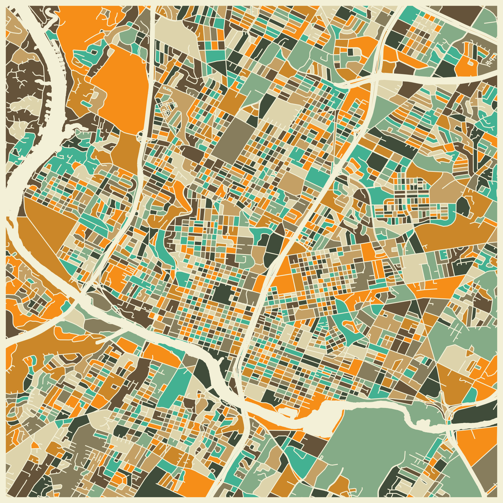

# Jazzberry Blue Maps

A recreation of maps designed by artist Jazzberry Blue with code. The program takes in shape layers and intricate coordinate data, transforms all intersecting streets into polygons, and randomly fills those polygons with a pre-defined selection of colors.

## Screenshots

## Tech Stack

Python, Matplotlib, GeoPandas, Shapely, NumPy